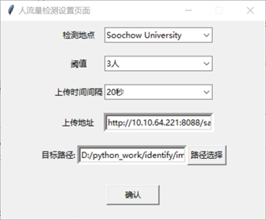
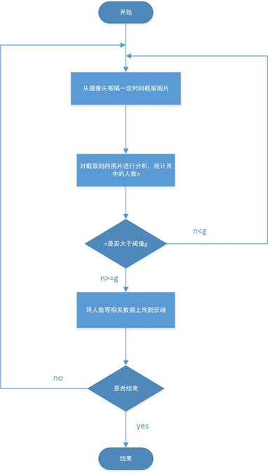

# Traffic monitoring platform for public places

## Table of contents

- [Introduction](#introduction)
- [YOLO V3](#yolo-v3)
- [Edge](#edge)

### Introduction

The purpose of this project is to realize the calculation of public places' pedestrian flow, so as to provide the information of public places' pedestrian flow to people in need. First of all, we collect video data of people flow and location through the camera, and the edge calculates the human flow in real time according to the current data. Here, we use YOLO, a deep learning framework for target detection widely used in recent years, in which the newly proposed YOLO V3 is used to realize face detection and then realize human flow calculation.

### YOLO V3

The convolutional neural network was proposed by Fukushima in 1980. The classical convolutional neural network consists of several convolutional layers and pooling layers alternately, which are used for feature extraction of objects (such as images). Then it is spread as a 1-dimensional vector, and the classification task is completed by a classifier composed of a full connection layer (multi-layer perceptron).
In recent years, the YOLO model has experienced three iterations through its own continuous optimization and absorption of the advantages of other target detection models such as SSD (Single Shot Multibox Detector) and Faster RCNN. The latest YOLO V3 features significant improvements in speed and accuracy, and is used in a number of areas. Different from Faster RCNN, regional based fully convolutional network (R-FCN) and other networks adopt the algorithm idea that combines regional Suggestions and classifiers. The IMAGE is divided into S×S grids by THE YOLO model, and the bounding box, confidence degree and category probability of the targets contained in all grids are predicted once by the regression method. Therefore, YOLO is far superior to other target detection networks in recognition speed, and its recognition speed can meet the real-time requirements of practical application scenes.
The YOLO V3 network structure is shown as follows.

Since deep learning requires a large number of training samples, the amount of data will directly affect the accuracy of face recognition. We use our WIDER FACE data set as a training set. WIDER FACE data set is a benchmack dataset of 32,203 pictures and 393,703 faces, taking into account such factors as face size, location and occlusion.

### Edge
Edge programs are written in Python. First, input relevant information through the edge interface, as shown in the figure below:

"location" means the place where the traffic is to be tested. "Threshold" means that if the number of detected people is less than the threshold, the data will not be reported to the cloud. If the number of people is greater than or equal to the threshold, it will be reported to the cloud. "Upload time interval" T means that each time interval T analyzes the images detected by the current camera. Time T is generally not appropriate to be set too large, otherwise the current flow of people cannot be timely understood. The "upload address" represents the cloud address. Target path represents the folder in which the captured images from the camera are temporarily stored.
Edge of the process as shown in figure 8, first through the camera to detect traffic location to test the situation at this time, and then according to "upload time interval t," every time t to the time of the detected image capture, and survival to choose good folder, and then call the number recognition program images of intercepted number analysis, calculation of the number, the number of people at the same time will be compared with the threshold, if greater than or equal to the number of threshold value is calculated, it will test location, number, time three data uploaded to the cloud. If the number of people is less than the threshold, the data will not be uploaded to the cloud. Then proceed to the next round of analysis. Here is the flow chart.

